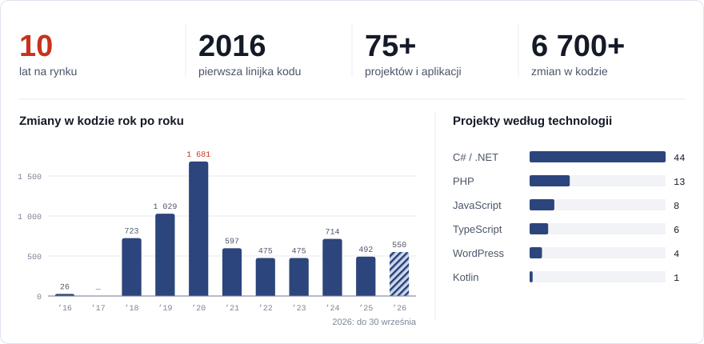

# Digital Templars

Software house z Polski. Od 2016 roku projektujemy i budujemy oprogramowanie na zamówienie: systemy dla firm, aplikacje webowe i produkty SaaS. Prowadzimy projekt od pomysłu i analizy, przez wdrożenie, po wieloletnie utrzymanie.

<picture>
  <source media="(prefers-color-scheme: dark)" srcset="./assets/stats-dark.svg">
  
</picture>

### Czym się zajmujemy

- **Oprogramowanie na zamówienie**: systemy wspierające procesy w firmach, integracje, panele administracyjne
- **Produkty SaaS**: aplikacje wielodostępne (multi-tenant) rozwijane i utrzymywane latami
- **Aplikacje webowe i mobilne**: od MVP do produkcji
- **Strony i sklepy**: WordPress i rozwiązania szyte na miarę

### Technologie

### Kontakt

---

<b>English</b>

Software house from Poland. Since 2016 we have been designing and building custom software: business systems, web applications and SaaS products, taking them from idea and analysis through launch to long-term maintenance.

**What we do:** custom business software and integrations, multi-tenant SaaS products, web and mobile applications from MVP to production, WordPress and bespoke websites.

**Contact:** [templars.digital](https://templars.digital)

